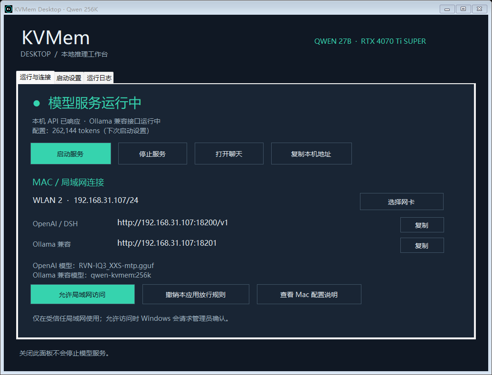
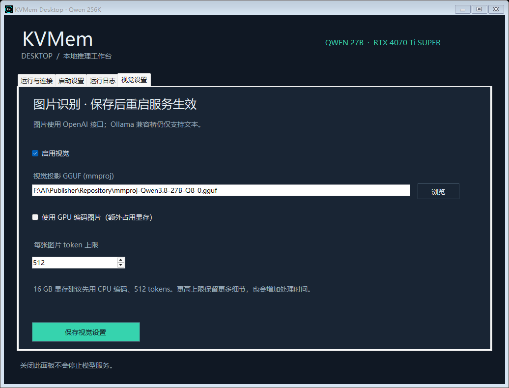

# KVMem Desktop

Windows desktop launcher and LAN control panel for [`kvmem-llama.cpp`](https://github.com/kvmem/kvmem-llama.cpp).

It starts `llama-kvmem-server`, exposes its OpenAI-compatible endpoint, and provides a small text-only Ollama API compatibility bridge so another computer on the LAN can reuse the same loaded model.



## Features

- Start and stop the KVMem server without keeping a terminal open, including while the model is loading or busy.
- Configure GGUF/model paths, 256K context, GPU history budget, generation reserve, and thinking budget.
- Open the bundled browser chat UI.
- Copy local and LAN endpoint addresses.
- Create or revoke a subnet-scoped Windows Firewall rule for ports `18200` and `18201`.
- Show the KVMem runtime log.
- Load a matching `mmproj` vision projector and accept image inputs through the OpenAI-compatible API.
- Serve a text-only Ollama-compatible API at port `18201` without loading a second copy of the model.

## Requirements

- Windows x64 and an NVIDIA GPU supported by your KVMem runtime.
- A downloaded Windows build of `kvmem-llama.cpp` containing `llama-kvmem-server.exe`.
- A compatible GGUF model. This project was tested with `RVN-IQ3_XXS-mtp.gguf` on an RTX 4070 Ti SUPER 16 GB and 64 GB system RAM.
- Node.js available as `node.exe` on `PATH` for the Ollama compatibility bridge. The OpenAI endpoint works without the bridge.

Model weights and the KVMem runtime are **not included**. Download them from their respective upstream projects and review their licenses.

## Quick start

1. Download and extract [KVMem Desktop v1.1.1](dist/KVMem-Desktop-v1.1.1.zip), or build from source. Verify the archive with [its SHA-256 file](dist/KVMem-Desktop-v1.1.1-SHA256.txt).
2. Run `KVMem.exe`.
3. In **启动设置**, select `llama-kvmem-server.exe` and the GGUF model.
4. Save settings and select **启动服务**.
5. Open `http://127.0.0.1:18200/` or use the displayed API address.

The default tested profile is:

- Context: `262144`
- KVMem GPU history budget: `45056`
- Generation reserve/output cap: `20480`
- Q8_0 main KV, F16 MTP KV, MTP draft length 3
- Thinking budget: `16384`

The total context includes prompts, history, thinking, and output. A single generation cannot exceed the configured reserve.

## Vision

Open **视觉设置** in the launcher, enable vision, and select the matching `mmproj` GGUF. On a 16 GB GPU, leave **使用 GPU 编码图片** off initially: the projector runs on CPU and preserves VRAM for the language model. The tested starting point is `512` image tokens per image.



Send images through the OpenAI-compatible `POST /v1/chat/completions` endpoint using `image_url` message content. The Ollama bridge remains text-only.

## DSH Desktop / OpenAI-compatible clients

Use:

| Field | Value |
|---|---|
| Protocol | `openai-completions` |
| Local base URL | `http://127.0.0.1:18200/v1` |
| LAN base URL | `http://PC_LAN_IP:18200/v1` |
| Model ID | Your GGUF filename, for example `RVN-IQ3_XXS-mtp.gguf` |
| API key | Any placeholder, such as `kvmem-local` |
| Context | `262144` |
| Maximum output | `20480` or less |

For DSH compatibility, use:

```yaml
compat:
  supportsDeveloperRole: false
  maxTokensField: max_tokens
```

## Ollama-compatible clients

Use base URL `http://PC_LAN_IP:18201` and model name `qwen-kvmem:256k`.

The bridge supports `/api/tags`, `/api/show`, `/api/ps`, `/api/chat`, and `/api/generate`, including streaming text. It does not implement model downloads, images, tool calls, raw prompts, legacy context arrays, or structured output. Inference still runs in KVMem; this is not an Ollama-native KVMem backend.

## LAN access

Select the real LAN adapter in the app and click **允许局域网访问**. Windows asks for administrator approval and creates a rule named `KVMem Desktop LAN`, limited to the selected local address/subnet and TCP ports `18200` and `18201`.

The server has no authentication. Use it only on a trusted private LAN and do not expose these ports to the public Internet.

## Performance observed on the test PC

With `RVN-IQ3_XXS-mtp.gguf`, RTX 4070 Ti SUPER 16 GB, and 64 GB RAM:

| Test | Result |
|---|---:|
| Short Chinese response | 50.7 tokens/s |
| Generation after a ~250K-token prompt | 36.4 tokens/s |
| Follow-up with ~250K cached history | 35.1 tokens/s; 8.45 s total |
| Fresh 261K-token image + text request | Completed in 5m 55s; 57.5 tokens/s generation |

The 261K-token image + text run used a 640×480 synthetic image and repetitive synthetic text with thinking disabled. It consumed 261,382 prompt tokens plus 47 output tokens, correctly recognized the image, and used about 15.2 GiB of 16.4 GiB VRAM. It verifies capacity and basic multimodal behavior, not retrieval accuracy on real documents.

## Build

Run in Windows PowerShell:

```powershell
powershell -NoProfile -ExecutionPolicy Bypass -File .\build.ps1
```

The project uses Windows Forms and the .NET Framework 4.x compiler included with Windows. Keep `KVMem.exe`, `control.ps1`, `ollama-kvmem-bridge.cjs`, and the icon in the same directory.

To rebuild the distributable ZIP and checksum, run `powershell -NoProfile -ExecutionPolicy Bypass -File .\package.ps1`. It uses the blank `settings.example.json` as the packaged `settings.json`.

## Notes

- The KVMem server is single-slot. Alternating unrelated chats can reduce prompt-cache reuse.
- Closing the panel does not stop the server. Use **停止服务** to release VRAM.
- The first very long request may need a client timeout of 900 seconds or more.
- This launcher is an independent community utility and is not affiliated with the upstream KVMem, llama.cpp, Ollama, Qwen, LM Studio, or DSH projects.
